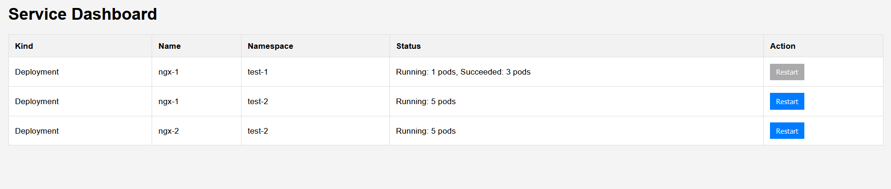

# k8s-restart-app

[](https://github.com/k8scope/k8s-restart-app/actions/workflows/tests.yaml)
[](https://github.com/k8scope/k8s-restart-app/actions/workflows/test_e2e.yaml)

A simple application that allows to restart services running in K8s. The service that should be allowed to be restarted, must be defined in the configuration file.

## UI

The application provides a simple UI to restart services. The UI is available at the root path of the application.



## Configuration

The configuration of the application is mostly done through environment variables. The following environment variables are available:

| Name | Type | Default | Description |
|------|------|---------|-------------|
| `LISTEN_ADDRESS` | string | `:8080` | The address the application should listen on. |
| `LISTEN_MONITORING_ADDRESS` | string | `:6060` | The address the application should listen on for the `/metrics` prometheus and `/debug/pprof` endpoints. |
| `CONFIG_FILE_PATH` | string | `config.yaml` | The path to the configuration file. |
| `KUBE_CONFIG_PATH` | string | `` | The path to the kubeconfig file. If not specified, the application tries to use the in-cluster config. |
| `WATCH_INTERVAL` | int | `10` | The interval in seconds the application watches for pod, deployment or statefulset changes |
| `FORCE_UNLOCK_SEC` | int | `300` | The time in seconds a restart can take before the lock is force released. |

In order to provide a list of services that should be allowed to be restarted, a configuration file must be provided. In that file, the services are defined as follows:

```yaml
services:
  - kind: Deployment # The kind of the service (Deployment, StatefulSet)
    name: my-deployment # The name of the service
    namespace: my-namespace # The namespace the service is running in
```

In order for the application to actually be able to restart the services, the service account the application is running under, must have the necessary permissions. The following RBAC configuration can be used to grant the necessary permissions:

```yaml
apiVersion: rbac.authorization.k8s.io/v1
kind: ClusterRole
metadata:
  name: restart-app
rules:
  - apiGroups: [""]
    resources: ["pods"]
    verbs: ["get", "list", "watch"]
  - apiGroups: ["apps"]
    resources: ["deployments", "statefulsets"]
    verbs: ["get", "list", "watch", "patch"]
---
apiVersion: rbac.authorization.k8s.io/v1
kind: ClusterRoleBinding
metadata:
  name: restart-app
roleRef:
  apiGroup: rbac.authorization.k8s.io
  kind: ClusterRole
  name: restart-app
subjects:
  - kind: ServiceAccount
    name: restart-app
    namespace: default
---
apiVersion: v1
kind: ServiceAccount
metadata:
  name: restart-app
```

## API

The application provides a simple API to restart services. The following endpoints are available:

| Endpoint | Method | Description |
|----------|--------|-------------|
| `/` | GET | Returns the HTML control page. |
| `/api/v1/service` | GET | Returns a list of services that can be restarted. |
| `/api/v1/service/status` | GET | Returns the status of the service with the given kind, namespace and name. As websocket stream. |
| `/api/v1/service/{kind}/{namespace}/{name}/restart` | POST | Restarts the service with the given kind, namespace and name. |

### Monitoring API

The application provides a monitoring API to get information about the application itself. The following endpoints are available:

| Endpoint | Method | Description |
|----------|--------|-------------|
| `/metrics` | GET | Returns the prometheus metrics. |
| `/debug/pprof` | GET | Returns the pprof endpoints. |
| `/debug/pprof/cmdline` | GET | Returns the pprof endpoint. |
| `/debug/pprof/profile` | GET | Returns the pprof endpoint. |
| `/debug/pprof/symbol` | GET | Returns the pprof endpoint. |
| `/debug/pprof/trace` | GET | Returns the pprof endpoint. |

## Metrics

The application provides the Go runtime metrics as well as a number of custom metrics. The metrics are available at the `/metrics` endpoint. The following custom metrics are available:

| Name | Type | Description |
|------|------|-------------|
| `restart_app_connected_status_watchers` | Gauge | The number of connected status watchers. |
| `restart_app_restarts_total` | Counter | The total number of restarts. |
| `restart_app_restarts_failed_total` | Counter | The total number of failed restarts. |

All custom metrics are labeled with the kind, namespace and name of the service.
